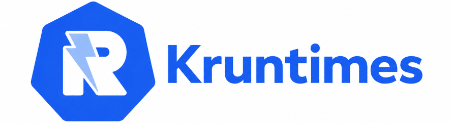

<p align="center">
  
</p>

A two-layer scheduling system built on Kubernetes that eliminates cold-start latency by keeping warm runtime pods ready to execute code in milliseconds. Built for AI agents, CI/CD tasks, serverless functions, and any short-lived, high-concurrency workloads.

## Background
Building a serverless/FaaS platform on vanilla Kubernetes faces several structural challenges:

**Cold starts are hard to make consistently sub-second**

A Pod startup path includes scheduling, image distribution, container creation, network initialization, readiness checks, and application initialization. After scale-to-zero, vanilla Kubernetes can struggle to deliver consistently sub-second startup.

Technologies such as [Firecracker](https://firecracker-microvm.github.io/), [lazy image loading with containerd stargz snapshotter](https://github.com/containerd/stargz-snapshotter), image caching, and node pre-warming can reduce cold-start latency, but they usually require cooperation from the node runtime or infrastructure layer — not just an upper-level application platform.

In other words, fast microVM boot time alone is not the full cold-start story. The full path still includes image loading, network setup, runtime initialization, and application readiness.

**The Kubernetes control plane is not designed as a fine-grained function scheduler**

The default Kubernetes scheduler and control-plane object model are better suited to relatively long-lived Pods than to mapping every function invocation to a short-lived Pod.

High volumes of short-lived, high-concurrency tasks amplify overhead across the API server, scheduler, CRI, CNI, image pulling, and controller loops. The Kubernetes [Scheduling Framework](https://kubernetes.io/docs/concepts/scheduling-eviction/scheduling-framework/) is extensible, but using it effectively often requires infrastructure-level ownership.

Batch schedulers such as [Volcano](https://volcano.sh/) can improve queuing, fairness, gang scheduling, and resource-aware placement. However, they are primarily designed for batch, AI/ML, HPC, and big-data workloads, rather than fine-grained function invocation scheduling.

**There is still an elasticity gap**

[Horizontal Pod Autoscaler](https://kubernetes.io/docs/tasks/run-application/horizontal-pod-autoscale/) can scale workloads based on metrics, and [KEDA](https://keda.sh/) can improve event-driven scaling and scale-to-zero behavior. [Knative Serving](https://knative.dev/docs/serving/) can also buffer requests during scale-from-zero through its Activator component.

However, these systems mainly improve *when* to scale and how to route or buffer traffic. They do not, by themselves, eliminate the underlying Pod startup latency.

In production, this usually becomes a trade-off among:

- pre-warmed pools,
- request buffering,
- asynchronous queues,
- image optimization,
- node-level caching,
- startup latency,
- and infrastructure cost.

This is the core problem: the platform may be able to decide to scale quickly, but the underlying execution substrate may still be slow to materialize capacity.

**Conway's Law matters**

The team building the serverless platform is often not the same team managing the Kubernetes control plane, node runtime, networking, or cluster infrastructure.

If the platform team cannot change schedulers, container runtimes, snapshotters, CNI behavior, image caching policies, or node pre-warming strategies, then the practical path is usually to build above Kubernetes rather than depend on invasive changes inside it.

This does not mean Kubernetes is a bad substrate. It means that vanilla Kubernetes is not, by itself, a complete low-latency FaaS runtime.

**Summary**

Vanilla Kubernetes is a reasonable substrate for serverless platforms, but not a complete low-latency FaaS runtime by itself.

The harder requirements — sub-second cold starts, fine-grained scheduling, and fast elasticity — usually require either infrastructure-level optimizations or a platform layer that deliberately avoids treating every invocation as a new Pod.

## Design

kruntimes addresses these challenges by treating Kubernetes as an IaaS-like substrate and moving serverless-specific logic into the application layer, where it remains under the platform team's control.

### Reuse over creation

Instead of creating a new Pod for every request, kruntimes maintains pools of pre-warmed **Runtime Pods**. Each pod already has the required toolchain, dependencies, and a running daemon. When a Run arrives, the scheduler assigns it to an existing hot pod.

This removes the slowest parts of the critical path — Kubernetes scheduling, image pulling, and container startup — from request time. For lightweight Runs, dispatch latency can drop from seconds or minutes to milliseconds.

Each Run executes in a clean workspace with explicit setup, teardown, timeout, cancellation, and resource cleanup. For untrusted workloads, Runtime implementations can add stronger isolation boundaries such as per-run containers, gVisor, Firecracker, nsjail, or other sandboxing mechanisms.

### Two-layer scheduling

```text
Layer 1 (K8s)  →  maintains Runtime Pod pools (coarse, low-frequency)
Layer 2 (app)  →  assigns individual Runs to pods within a pool (fine, high-throughput)
```

This separation lets kruntimes implement application-level queuing, prioritization, backpressure, and resource allocation without touching Kubernetes internals.

Runtime Pods continuously report health, capacity, supported Runtime labels, active Run count, and load. The application scheduler uses this information to place Runs onto hot pods without relying on Kubernetes scheduling for every execution.

Because multiple Runs may share a Runtime Pod, kruntimes enforces per-Run concurrency, timeout, cancellation, and resource limits at the runtime layer.

### Runtime abstraction

Different execution environments — such as language runtimes like Go, Python, and Node.js, or specialized executors like BuildKit — are modeled as distinct **Runtime** types.

Each Runtime is backed by an independent Deployment pool with a specific container image, toolchain, resource profile, and security policy. This provides natural environment isolation, guarantees consistency across Runs, and makes adding new environments an operational workflow: build a new Runtime image, deploy a pool, and register its labels and capabilities.

### Declarative CRDs, not P2P

The **Run CRD** is the durable source of truth for control-plane state: what to run, which Runtime is required, which pod is assigned, current lifecycle phase, retry policy, and references to results.

Control-plane coordination happens through CRD state transitions:

- **Scheduler** watches Pending Runs and assigns them to healthy Runtime Pods with available capacity.
- **Runtimed** watches Runs assigned to its pod, delegates execution to the local Runtime Server via gRPC, and updates Run status.
- **Runtime Server** performs the actual execution inside the Runtime Pod and reports completion, failure, timeout, or cancellation.
- **Failover controller** detects stale assignments when a Runtime Pod disappears or stops heartbeating, then marks affected Runs eligible for rescheduling according to their retry policy.

The CRD stores compact lifecycle state and references to outputs. High-volume data such as logs, artifacts, streaming output, and fine-grained heartbeats should be stored outside etcd.

No request-time Pod creation. No per-run Kubernetes scheduling. No global connection pool or direct pod-to-pod routing requirement. Kubernetes remains the coarse-grained resource substrate; kruntimes owns the fine-grained serverless control plane.

## Architecture

```text
                         ┌──────────────┐
                         │     krt      │
                         └──────┬───────┘
                                │ create Run
                                ▼
┌─────────────────────────────────────────────────────┐
│  Run CRD (Pending)                                  │
│    spec.runtime: bash                               │
│    spec.args: ["echo hello"]                        │
│    status.phase: Pending                            │
└────────────────────────┬────────────────────────────┘
                         │ watch
                         ▼
┌─────────────────────────────────────────────────────┐
│  Scheduler                                          │
│    finds healthy Runtime Pods by runtime label      │
│    checks capacity / load / readiness               │
│    sets assignment + phase=Scheduled                │
└────────────────────────┬────────────────────────────┘
                         │ watch assigned Runs
                         ▼
┌─────────────────────────────────────────────────────┐
│  Runtime Pod                                        │
│                                                     │
│  ┌────────────────────┐        gRPC                 │
│  │     Runtimed       │ ─────────────────────────▶  │
│  │  - claims Run      │                             │
│  │  - Execute()       │        ┌─────────────────┐  │
│  │  - Status()        │        │ Runtime Server  │  │
│  │  - Cancel()        │        │ bash / python / │  │
│  │  - updates CRD     │        │ custom executor │  │
│  └────────────────────┘        └─────────────────┘  │
└─────────────────────────────────────────────────────┘


┌────────────────────┐
│  Runtime CRD        │
│    image            │
│    port             │
│    replicas         │
│    labels           │
│    resources        │
│    concurrency      │
└─────────┬──────────┘
          │ reconcile
          ▼
┌──────────────────────────────┐
│  Runtime Controller           │
│    creates Runtime Deployment │
│    injects runtimed sidecar   │
└─────────┬────────────────────┘
          │ creates
          ▼
┌──────────────────────────────┐
│  Runtime Deployment / Pods    │
└──────────────────────────────┘
```

### Components

| Component | Description |
|-----------|-------------|
| **Run CRD** | Durable control-plane record and state machine for one execution. Tracks desired runtime, input, assignment, lifecycle phase, retry policy, timestamps, and result references. |
| **Runtime CRD** | Defines a runtime pool: image, port, replicas or min/max replicas, labels, resource profile, concurrency limit, and runtime-specific configuration. |
| **Runtime Controller** | Watches Runtime CRs and reconciles them into Deployments. Each Runtime Pod contains the Runtime Server container plus the kruntimes-managed `runtimed` sidecar. |
| **Scheduler** | Kubernetes controller that watches Pending Runs, finds healthy Runtime Pods in the same namespace with matching labels and available capacity, then assigns Runs by updating Run status. |
| **Runtimed** | Sidecar daemon in each Runtime Pod. Watches Runs assigned to its pod, atomically claims them, delegates execution to the local Runtime Server via gRPC, and updates Run status. |
| **Runtime Server** | Pluggable local gRPC service that performs the actual execution. Implements `Execute`, `Status`, `List`, and `Cancel`. Built-in implementations include bash and Python. |
| **Stale Run Reaper** | Watches Running Runs and checks assigned Pod health. If the pod is deleted or unhealthy for too long, resets the Run for retry (if RetryPolicy configured) or marks it Failed. Runs in the controller manager. |
| **krt** | CLI for creating Runs, watching status, streaming logs, cancelling executions, and retrieving results. |

### Runtime Pod Model

Each Runtime Pod contains two cooperating processes:

```text
Runtime Pod
├── runtimed sidecar        # kruntimes control agent
└── Runtime Server          # bash / python / custom executor
```

`runtimed` owns Kubernetes communication. The Runtime Server only exposes a local execution API and does not need to know about Kubernetes.

### Run State Machine

```text
Pending
  └─ Scheduled
       └─ Running
            ├─ Succeeded
            ├─ Failed
            ├─ Timeout
            └─ Cancelled
```

The Run CRD should also use conditions for detailed status, for example:

```yaml
status:
  phase: Running
  assignment:
    podName: runtime-bash-abc123
    podUID: 4f9...
    assignedAt: "2026-05-27T10:00:00Z"
  conditions:
    - type: Scheduled
      status: "True"
      reason: Assigned
    - type: Running
      status: "True"
      reason: RuntimeStarted
```

### Assignment and Claiming

Scheduling and execution are separate steps:

1. The Scheduler assigns a Pending Run to a healthy Runtime Pod with available capacity.
2. The assigned Runtimed observes the Run.
3. Runtimed atomically claims the Run by transitioning it from `Scheduled` to `Running`.
4. If the claim update fails, the Run was already cancelled, expired, or reassigned.
5. Runtime Server executes the workload locally.
6. Runtimed writes the terminal status and result references back to the Run CRD.

This prevents stale Runtime Pods from overwriting newer scheduling decisions.

### Execution Semantics

kruntimes provides **at-least-once** Run execution. A Run may be executed more than once when a retry is configured or when a stale Runtime Pod is detected and the Run is rescheduled. Runtime implementations and user code should be safe to retry or should use external idempotency keys when side effects matter.

`status.attempt` is 1-based and counts execution attempts, including the initial attempt. If `spec.retryPolicy` is omitted, the default is `maxAttempts: 1`, which means no retry. When retries are enabled:

- `maxAttempts` is the total number of attempts, not the number of retries.
- `backoff` is the initial retry delay. Delay doubles per retry and is capped at 60 seconds.
- `retryableReasons` limits which failure reasons can retry. If empty, all reasons except `Cancelled` are retryable.
- During backoff, the Run remains `Running` with a `Running=False` condition that records the retry reason and message.

Failure reasons are stable machine-readable strings used by retry policy and conditions:

| Reason | Meaning |
|--------|---------|
| `RuntimeError` | The runtime executed the Run but the workload failed. |
| `RuntimeExecute` | Runtimed could not call Runtime Server `Execute`. |
| `PrepareSource` | Runtimed could not prepare inline or repository source. |
| `Timeout` | The Run exceeded `spec.timeout` or the Runtime Server reported a timeout. |
| `Cancelled` | The user requested cancellation. |
| `PodGone` | The assigned Runtime Pod disappeared before the Run completed. |
| `PodTerminating` | The assigned Runtime Pod is terminating. |
| `PodUnhealthy` | The assigned Runtime Pod is no longer ready. |

Timeouts are enforced by runtimed using `spec.timeout` and also passed to the Runtime Server. On timeout, runtimed sends best-effort `Cancel` to the Runtime Server. If retries remain and `Timeout` is retryable, the Run is retried; otherwise it terminates with phase `Timeout`, not generic `Failed`.

Cancellation is user initiated by setting `spec.cancelRequested: true`, usually through `krt cancel <run>`. Cancellation takes priority over normal running-state polling, calls Runtime Server `Cancel` best-effort, does not retry, and terminates the Run with phase `Cancelled`.

When an assigned Runtime Pod is deleted, terminating, or unhealthy, the stale Run reaper classifies the Run with a pod-related reason. If retry policy allows retry, it clears `status.assignedPod`, resets scheduling state to `Pending`, and the Scheduler assigns a new Runtime Pod. If retry is exhausted or not allowed, the Run terminates as `Failed`.

Runtime Pods report runtimed liveness through the Pod condition `kruntimes.kruntimes.com/RuntimedReady`. Static per-pod capacity is declared on `Runtime.spec.capacity.resources`; the built-in `runs` resource controls concurrent Run executions per Runtime Pod and is copied to the Pod annotation `kruntimes.kruntimes.com/capacity.runs`. The Scheduler derives fast-changing usage from its Run cache and only assigns to Runtime Pods that are Kubernetes Ready, runtimed-ready, and below capacity. Runtimed also enforces the same local capacity before claiming a Scheduled Run.

Terminal phases are:

| Phase | Semantics |
|-------|-----------|
| `Succeeded` | The Runtime Server reported success. `$OUTPUTS` is read into bounded `status.outputs`. |
| `Failed` | The Run exhausted retries for a non-timeout failure reason. |
| `Timeout` | The Run exhausted retries for `Timeout` or timed out with no retry configured. |
| `Cancelled` | Cancellation was requested and processed. |

### Runtime Server API

The Runtime Server API is local to a Runtime Pod:

```text
Execute(RunSpec) -> ExecutionID
Status(ExecutionID) -> ExecutionStatus
List() -> repeated Execution
Cancel(ExecutionID) -> CancelResult
Health() -> HealthStatus
```

`List` is used by Runtimed to recover local execution state after restart. On startup, runtimed compares Runtime Server executions with Runs assigned to its Pod, rebuilds its in-memory active Run set, and resumes status polling. If a Running Run is no longer present in the Runtime Server, runtimed routes it through the normal retry or terminal failure path. `Cancel` is best-effort and should eventually result in `Cancelled`, `Failed`, or `Timeout`. `Health` is used for Kubernetes pod liveness probes and runtime health checks.

### Data Plane vs Control Plane

The Run CRD is the source of truth for compact lifecycle state.

Large or high-frequency data should not be stored directly in etcd:

- logs,
- artifacts,
- stdout/stderr streams,
- large results,
- fine-grained progress events,
- high-frequency heartbeats.

Instead, the Run status should store references to external storage or streaming channels.

## Quick Start

### Prerequisites

- Go 1.26+
- Kubernetes cluster (or [kind](https://kind.sigs.k8s.io/) for E2E)
- Helm 3

### Build

```bash
make build
```

Produces five binaries: `scheduler`, `controller`, `runtimed`, `bash-runtime`, `krt`. The Python runtime is Docker-only.

### Deploy

```bash
make deploy           # platform (CRDs, scheduler, controller, RBAC)
make deploy-runtimes  # built-in runtimes (bash, python)
```

### Create a Run

```bash
krt run -r bash --wait -- echo "Hello from kruntimes"
echo "print('Hello')" | krt run -r python -f - --wait
krt list --all-namespaces
krt get run-xxxxxxxx
```

### E2E Testing

```bash
make e2e-setup    # creates kind cluster, builds images, deploys everything
make e2e-test     # full lifecycle + scheduler responsiveness
make e2e-cleanup  # tears down kind cluster
```

## Roadmap

### v0.1 — Core Execution

- [x] Run CRD with lifecycle: Pending → Scheduled → Running → Succeeded/Failed
- [x] Runtime CRD + controller with automatic runtimed sidecar injection
- [x] Pluggable gRPC Runtime Server interface
- [x] Default bash runtime
- [x] Built-in Python runtime
- [x] Two-layer scheduling with least-loaded strategy
- [x] Helm chart deployment
- [x] Prometheus metrics for scheduler and runtimed
- [x] Leader election for scheduler and controller HA
- [x] E2E test suite with kind

### v0.2 — Reliability & Operability

- [x] Run cancellation and timeout phases
- [x] Retry policy: maxAttempts, backoff, retryable failure reasons
- [x] Stale Run reaper for dead or stale Runtime Pods
- [x] Timeout terminal failures end in `RunTimeout`, not generic `Failed`
- [x] Cancelled / Timeout / Failed terminal condition updates use a shared terminal transition path
- [x] Scheduler keeps Runs `Pending` when no Runtime Pod is available
- [x] Scheduler assignment checks Pod readiness, not only Pod existence
- [x] Unified retry engine shared by runtimed and stale reaper
- [x] Deterministic attempt counting and retry exhaustion behavior
- [x] Runtime Pod heartbeat and capacity reporting
- [x] Runtimed recovery after restart using Runtime Server `List`
- [x] Log streaming via `krt logs`
- [ ] Result and artifact references outside etcd
- [ ] TTL-based garbage collection for completed Runs
- [x] Standard metrics: queue time, dispatch latency, execution time, retries, failures, active Runs
- [x] Documented execution semantics: at-least-once, retry, timeout, cancellation
- [x] E2E coverage for timeout behavior
- [x] E2E coverage for no-capacity scheduling behavior
- [x] E2E coverage for stale-pod retry behavior
- [ ] E2E coverage for cancellation races

### v0.3 — Workflow

- [x] Workflow CRD with jobs, steps, needs, and outputs
- [x] Workflow controller creates child Runs from DAG steps
- [x] Workflow status aggregation from child Runs
- [ ] Workflow cancellation, timeout, and retry propagation
- [x] Minimal `${{ }}` expression resolution for inputs and previous step outputs
- [x] `$OUTPUTS` file → bounded `Run.Status.Outputs`
- [x] CLI: `krt workflow create/list/get`
- [x] CLI: `krt cancel <run>`
- [x] CLI: `krt logs` with `-f`/`--follow` and `--tail`

### v0.4 — Reuse & Developer Experience

- [ ] Action CRD for reusable step templates
- [ ] `uses: actions/<name>` with `with:` inputs
- [ ] Action input/output passing
- [ ] WorkflowTemplate CRD for reusable workflow/job templates
- [ ] `uses: workflows/<name>` with `with:` inputs
- [ ] Runtime SDKs for Python and Go
- [ ] CLI improvements for logs, results, and debugging

### v0.5 — Runtime Expansion & Scheduling

- [ ] Built-in runtime: Go
- [ ] Built-in runtime: Node.js
- [ ] Experimental runtime: WASM/WASI
- [ ] Run priority
- [ ] Runtime affinity / anti-affinity
- [ ] Bin-packing scheduler strategy
- [ ] Pluggable scheduler strategy interface
- [ ] Runtime Pod draining mode

### v0.6 — Isolation & Specialized Resources

- [ ] Per-Run concurrency limits
- [ ] Per-Run CPU/memory accounting
- [ ] Experimental cgroup-based per-Run resource enforcement
- [ ] Runtime CRD support for extended resources
- [ ] Experimental GPU Runtime pools
- [ ] Security baseline: RBAC, ServiceAccount, securityContext, NetworkPolicy examples

### v0.7 — Advanced Runtime Integration

- [ ] Custom Runtime Server examples: Ray
- [ ] Custom Runtime Server examples: Slurm
- [ ] Experimental Runtime-managed scheduling mode
- [ ] Runtime-managed queue and status synchronization model

### v1.0 — Stable Platform

- [ ] Stable `v1` CRD APIs
- [ ] Upgrade and migration strategy
- [ ] Multi-tenant namespace isolation
- [ ] Production-ready observability dashboards
- [ ] Stable execution semantics compatibility contract
- [ ] Security hardening guide
- [ ] Performance benchmarks
- [ ] CronRun CRD
- [ ] Webhook triggers: GitHub, Slack, etc.

## Development

```bash
make proto                 # generate Go gRPC code
make proto-python          # generate Python gRPC stubs (requires uv)
make generate manifests    # generate deepcopy + CRDs
make test                  # unit tests
make test-integration      # integration tests (envtest)
make docker-build          # build all Docker images
```

## Python Runtime

### Development Setup

```bash
# Install uv (Python package manager)
curl -LsSf https://astral.sh/uv/install.sh | sh

# Generate Python gRPC stubs + install deps
cd runtimes/python
uv sync

# Run Python unit tests
uv run python -m unittest server_test -v
```

### How it works

The Python runtime is a standalone gRPC server (Python 3.13) deployed alongside the runtimed daemon. The runtimed handles code preparation (inline dump, git clone) on the shared `/workspace` volume, then delegates execution to the Python runtime via gRPC.

**Execution flow:**
1. Runtimed prepares source on `/workspace/<uid>/` — inline code dumped to the `entrypoint` file (default `"script"`), or git clone to `repo/`
2. Runtimed calls gRPC `Execute` with `working_dir` set to the prepared directory, `entrypoint` to the script name, and `handler` (if FaaS mode)
3. If `handler` is set (e.g. `"app.handler"`), the Python runtime imports the module and calls `handler(event)` with `args` as the event payload
4. Otherwise, it runs `python <working_dir>/<entrypoint> <args>` as a script

| Mode | Example |
|------|---------|
| Inline | `echo "print(1+1)" \| krt run -r python -f -` |
| File | `krt run -r python -f script.py` |
| FaaS | `echo $'def handler(e):\n  return {"ok": True}' \| krt run -r python -f - --handler "script.handler"` |
| Repo | `krt run -r python --repo-url https://github.com/user/proj.git` |
| Entrypoint | `krt run -r python --repo-url <url> --entrypoint "main.py"` |

## Run Lifecycle

```
Pending → Scheduled → Running → Succeeded
                            → Failed
                            → Timeout
                            → Cancelled
```

## Custom Runtimes

Implement the `Runtime` gRPC service (`api/runtime/v1/runtime.proto`):

```protobuf
service Runtime {
    rpc Execute(ExecuteRequest) returns (ExecuteResponse);
    rpc Status(StatusRequest) returns (StatusResponse);
    rpc List(ListRequest) returns (ListResponse);
    rpc Cancel(CancelRequest) returns (CancelResponse);
    rpc Health(HealthRequest) returns (HealthResponse);
}
```

Deploy with a Runtime CR:

```yaml
apiVersion: kruntimes.kruntimes.com/v1alpha1
kind: Runtime
metadata:
  name: my-python
spec:
  image: my-python-runtime:latest
  port: 9091
  replicas: 3
```

## Metrics

| Component | Port | Metric | Description |
|-----------|------|--------|-------------|
| Scheduler | :8080 | `kruntimes_scheduler_sync_total` | Runs processed |
| | | `kruntimes_scheduler_sync_duration_seconds` | Scheduling latency |
| | | `kruntimes_scheduler_no_pods_total` | Runs with no available runtime |
| Runtimed | :9090 | `kruntimes_runtimed_runs_total` | Runs completed |
| | | `kruntimes_runtimed_run_duration_seconds` | Execution duration |
| | | `kruntimes_runtimed_claim_conflicts_total` | Claim conflicts |
| Controller | :8082 | (controller-runtime defaults) | |

## Project Structure

```
api/
├── v1alpha1/          Run + Runtime CRD types
└── runtime/v1/        gRPC proto + generated code
cmd/
├── scheduler/         Scheduler entry point
├── controller/        Runtime controller entry point
├── runtimed/          Runtimed daemon entry point
└── krt/               CLI tool
runtimes/
├── bash/              Bash runtime gRPC server (Go)
│   └── cmd/
└── python/            Python runtime gRPC server + tests
    ├── server.py
    ├── server_test.py
    ├── cmd/main.py
    └── pb/             Generated gRPC stubs
internal/
├── runtimed/          Runtimed controller (claim + gRPC delegation)
│   ├── rleg/          Run Lifecycle Event Generator (polling + state diff)
│   ├── retry.go        Retry policy helpers (calcBackoff, shouldRetry)
├── controller/        Runtime + Workflow controllers, Stale Run Reaper
├── scheduler/         Run reconciler + scheduling strategies
└── krt/               CLI subcommands (run, get, list)
charts/
├── kruntimes/          Platform Helm chart (CRDs, scheduler, controller)
└── kruntimes-runtimes/ Built-in runtimes Helm chart
test/
├── e2e/               End-to-end tests (kind cluster)
└── integration/       Integration tests (envtest)
```

## License

Apache 2.0
