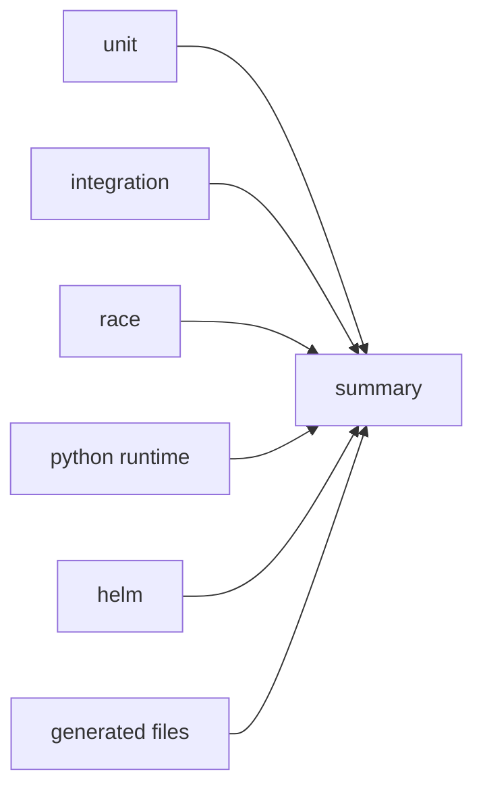

# kruntimes CI Workflow

This executable demo translates this repository's CI into a kruntimes
WorkflowRun. Six independent validation jobs check out the source and run in
parallel; `summary` publishes a bounded `result=passed` output after they all
succeed.



## Run on Kind

From the repository root, create a local Kind cluster with the current
kruntimes control plane, then build and start the demo:

```bash
make e2e-setup
make demo-ci-run
kubectl get workflowruns -n default -w
```

`demo-ci-run` builds the CI Runtime from this directory, using
`ghcr.io/kruntimes/bash-runtime:nightly` as its base. It loads that image into
the `kruntimes-e2e` Kind cluster, installs the Runtime, Actions, and Workflow,
then triggers a WorkflowRun. No registry push is required.

Set `DEMO_CI_KIND_CLUSTER`, `DEMO_CI_NAMESPACE`, `DEMO_CI_REPOSITORY`, or
`DEMO_CI_REF` to use a different Kind cluster, namespace, source repository, or
revision.

For the declarative equivalent, apply the reusable-Workflow form after the
Runtime, Actions, and Workflow exist:

```bash
kubectl create -n default -f demo/kruntimes-ci/workflow_run_reuse.yaml
```

## Expected result

The WorkflowRun reaches `Succeeded` after `unit`, `integration`, `race`,
`python-runtime`, `helm`, and `generated` all succeed. Inspect its final output
with:

```bash
kubectl get workflowruns -n default
kubectl get workflowrun <name> -n default -o yaml
```

The final value is available at `status.jobs.summary.outputs.result`:

```yaml
result: passed
```

## How the demo works

- **Local Actions.** `checkout-source` and `setup-go` are namespace-local
  reusable Actions. `uses` never downloads an arbitrary Marketplace Action.
- **Job isolation.** Each job checks out the source independently. Sequential
  steps share that job's PersistentWorkspace; parallel jobs do not share files.
  The demo needs no ArtifactStore or job-to-job file transfer.
- **Tool installation.** `setup-go` installs a versioned Go distribution with
  `kruntime-cache ensure`, then exports job-local `GOCACHE`, `GOMODCACHE`,
  `GOBIN`, `GOROOT`, and `PATH`. Other tools stay checkout-local: for example,
  `make proto generate manifests` installs `protoc`, Go plugins, and
  `controller-gen` into the job's `bin/` directory.
- **Scope.** This models CI execution, not GitHub event semantics. Webhook
  triggering, path filters, cancellation concurrency, and publishing the
  omitted Python SDK wheel remain external concerns.

The Runtime Pod requires egress to the selected repository and dependency
registries. Configure approved mirrors or proxy settings in its Runtime spec
when your cluster requires them.
